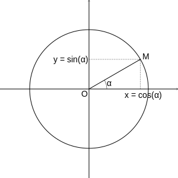

# Trigonometry

This repository provides a function to compute sine and cosine for data encoded
as fix point.

## Description of the algorithm

This algorithm is an implementation of the CORDIC algorithm.  
To find the sine and cosine of an angle $\alpha$ belonging to the interval
$\left[0;2\pi\right]$, the algorithm will determine the
coordinates of the point of the trigonometric circle corresponding to it.  
This point is known by the vector $\overrightarrow{v_{\alpha}}$ associated to
the angle $\alpha$.
Its coordinates are :
```math
\overrightarrow{v_{\alpha}} =
\begin{pmatrix} \cos(\alpha) \\ \sin(\alpha) \end{pmatrix}
```


### Basis

The principle of the algorithm is to converge a vector
$\overrightarrow{v}$ of known angle (and therefore of known coordinates) by
successive rotations of angles closer and closer to 0 toward the vector
$\overrightarrow{v_{\alpha}}$.  
At each rotation, the coordinates of the vector $\overrightarrow{v}$ are
computed. The coodinates of the final vector $\overrightarrow{v}$ are the cosine
and the sine of the angle $\alpha$.

### $\gamma$ angles

Let’s assume that a set of $n+1$ angles $\gamma_{i}$ such as
$\gamma_{i} > \gamma_{i+1}$ is defined. 

The vector $\overrightarrow{v_{i}}$ is rotated by the angle $\gamma_{i}$ either
clockwise or counterclockwise to converge towards $\overrightarrow{v_{\alpha}}$.

For $i=0$ :  
* If $\alpha - \gamma_{0} < 0 $, rotation is clockwise.  
* If $\alpha - \gamma_{0} > 0 $, rotation is counterclockwise.

$\forall i \in \\{ 1,...,n \\}$ :
* If $\alpha + \sum_{k=0}^{i-1}\sigma_{k}\gamma_{k} - \gamma_{i} < 0$,
rotation is clockwise.
* If $\alpha + \sum_{k=0}^{i-1}\sigma_{k}\gamma_{k} - \gamma_{i} > 0$,
rotation is counterclockwise.

So vector $\overrightarrow{v_{i+1}}$ is created as :

```math
\overrightarrow{v_{i+1}} = R_{i} \overrightarrow{v_{i}}
```

with $R_{i}$ the rotation matrix :

```math
R_{i} =
\begin{bmatrix}
  \cos(\gamma_{i}) & -\sigma_{i}\sin(\gamma_{i}) \\
  \sigma_{i}\sin(\gamma_{i}) & \cos(\gamma_{i})
\end{bmatrix}
```

$\sigma_{i}$ is $1$ or $-1$ depending of the direction of the rotation.

The relation between $\overrightarrow{v_{i}}$ and $\overrightarrow{v_{i+1}}$
is :
```math
\begin{align}
& \overrightarrow{v_{i+1}} = R_{i}\overrightarrow{v_{i}} \\
\Leftrightarrow & \overrightarrow{v_{i+1}} = 
    \begin{bmatrix} 
      \cos(\gamma_{i}) & -\sigma_{i}\sin(\gamma_{i}) \\ 
      \sigma_{i}\sin(\gamma_{i}) & \cos(\gamma_{i})
    \end{bmatrix}
    \overrightarrow {v_{i}} \\
\Leftrightarrow & \overrightarrow{v_{i+1}} =
    \cos(\gamma_{i})
    \begin{bmatrix}
       1 & -\sigma_{i}\tan(\gamma_{i})\\
      \sigma_{i}\tan(\gamma_{i}) & 1
    \end{bmatrix}
    \overrightarrow {v_{i}} 
\end{align}
```

The angles $\gamma_{i}$ are choosen such as $\gamma_{i}=\arctan{({2}^{-i})}$.

The relation between $\overrightarrow{v_{i}}$ and $\overrightarrow{v_{i+1}}$
is then :
```math
\overrightarrow{v_{i+1}} = \cos{ \left( \arctan(2^{-i}) \right) }
  \begin{bmatrix}
    1 & -\sigma_{i}{2}^{-i}\\
    \sigma_{i}{2}^{-i} & 1
  \end{bmatrix}
  \overrightarrow {v_{i}} 
```

### Multiplier coefficient

The value $\cos{\left(\arctan(2^{-i})\right)}$ does not depend on $\sigma_{i}$.
So they can be ignored during each rotation and factorized into a multiplier
coefficient that depends on $n$.
```math
K(n) = \prod_{i=0}^{n-1}{ K_{i} }
     = \prod_{i=0}^{n-1}{ \cos{ \left( \arctan(2^{-i}) \right) } }
     = \prod_{i=0}^{n-1}{ \frac{1}{\sqrt{1+2^{-2i}}} }
```

## Implementation of the algorithm

This part gives explaination about the content of the source files.

### Parameters

The input of the function is an __angle__ encoded on a 16 bits unsigned integer.
* It resolution is $2^{-13}$ radian.
* The minimum value is $0$.
* The maximum value $2\pi$ is encoded with the integer $51472$
($51472\times2^{-13} = 6,28320$).

The outputs of the function are the __sine__ and the __cosine__ of the __angle__
encoded on a 16 bits signed integer.  
* Their resolution is $2^{-14}$.
* The minimum value $-1$ is encoded with the integer $-16384$.
* The maximum value $1$ is encoded with the integer $16384$.

### Range reduction

The first step of the algorithm is to reduce the range of the input angle using
trigonometric formulas.

If the input angle $\alpha$ is greater than $\frac{3\pi}{2}$ :
* $cos(\alpha) = cos(2\pi-\alpha)$
* $sin(\alpha) = -sin(2\pi-\alpha)$

If the input angle $\alpha$ is between $\pi$ and $\frac{3\pi}{2}$ :
* $cos(\alpha) = -cos(\alpha-\pi)$
* $sin(\alpha) = -sin(\alpha-\pi)$

If the input angle $\alpha$ is between $\frac{\pi}{2}$ and $\pi$ :
* $cos(\alpha) = -cos(\pi-\alpha)$
* $sin(\alpha) = sin(\pi-\alpha)$

### Precision improvement

To increase the precision of the algorithm, the rotations are computed on
32 bits variables.  
Its is done by multiplicating by 65536 the implicated variables :
* the angle $\alpha$,
* the angles $\gamma_{i}$
* the sum of the rotation
* the coordinates of the vector $\overrightarrow{v}$

### $\gamma_{i}$ and $n$

With this choice, and knowing that the resolution of an angle is $2^{-13}$,
the software integer value of a $\gamma_{i}$ angle is 
$\gamma_{i} \div 2^{-13} \times 65536$.

The list of the $\gamma_{i}$ angles is given by the following table :

| i   | $\gamma_{i}$       | Integer  |
|:---:|:-----------------:|:---------:|
|  0  | 0,785398163397448 | 421657428 |
|  1  | 0,463647609000806 | 248918914 |
|  2  | 0,244978663126864 | 131521918 |
|  3  | 0,124354994546761 |  66762579 |
|  4  | 0,062418809995957 |  33510843 |
|  5  | 0,031239833430268 |  16771758 |
|  6  | 0,015623728620477 |   8387925 |
|  7  | 0,007812341060101 |   4194219 |
|  8  | 0,003906230131967 |   2097141 |
|  9  | 0,001953122516479 |   1048575 |
| 10  | 0,000976562189559 |    524288 |
| 11  | 0,000488281211195 |    262144 |
| 12  | 0,000244140620149 |    131072 |
| 13  | 0,000122070311894 |     65536 |
| 14  | 0,000061035156174 |     32767 |
| 15  | 0,000030517578115 |     16384 |
| 16  | 0,000015258789061 |      8192 |
| 17  | 0,000007629394531 |      4096 |
| 18  | 0,000003814697265 |      2048 |
| 19  | 0,000001907348632 |      1024 |
| 20  | 0,000000953674316 |       512 |
| 21  | 0,000000476837158 |       256 |
| 22  | 0,000000238418579 |       128 |
| 23  | 0,000000119209289 |        64 |
| 24  | 0,000000059604644 |        32 |
| 25  | 0,000000029802322 |        16 |
| 26  | 0,000000014901161 |         8 |
| 27  | 0,000000007450580 |         4 |
| 28  | 0,000000003725290 |         2 |
| 29  | 0,000000001862645 |         1 |

The $\gamma_{i}$ angle cannot be represented if $i \gt 29$. So for this
implementation of the algorithm, $n=29$.

For $i=11$ to $i=29$ the software integer value of the $\gamma_{i}$ angle can be
computed by divising by to software integer value of the $\gamma_{i-1}$ angle.

### Initial vector

To earn a rotation step, the first rotation angle $\gamma_{0}$ is applied in 
advance to the vector $\overrightarrow{v}$, so the initial vector
$\overrightarrow{v_{0}}$ is associated to an initial angle of
$\arctan{\left(2^0\right)}=\frac{\pi}{4}$ rad.  
Its coordinates are :
```math
\overrightarrow{v_{0}} =
\begin{pmatrix}
  \cos{\left(\frac{\pi}{4}\right)} \\
  \sin{\left(\frac{\pi}{4}\right)}
\end{pmatrix}
```

To earn a multiplication, the multiplier coefficient is applied at the
initialization of these variables.  
As the first rotation angle is not $\gamma_{0}$ but $\gamma_{1}$, this
coefficient is :
```math
K'(29) = \prod_{i=1}^{28}{ \frac{1}{\sqrt{1+2^{-2i}}} } = 0,858785336480428
```

So the integer software values of the modified coordinates of
$\overrightarrow{v_{0}}$ are :
```math
\left\{
\begin{aligned}
& x_0 = \cos{\left(\frac{\pi}{4}\right)}
  \div 2^{-14} \times 65536 \times K'(29) = 652032874 \\
& y_0 = \sin{\left(\frac{\pi}{4}\right)}
  \div 2^{-14} \times 65536 \times K'(29) = 652032874
\end{aligned}
\right.
```

The initial value of the sum of the rotations is :
```math
 \frac{\pi}{4} \div 2^{-13} \times 65536 = 421657428
```
